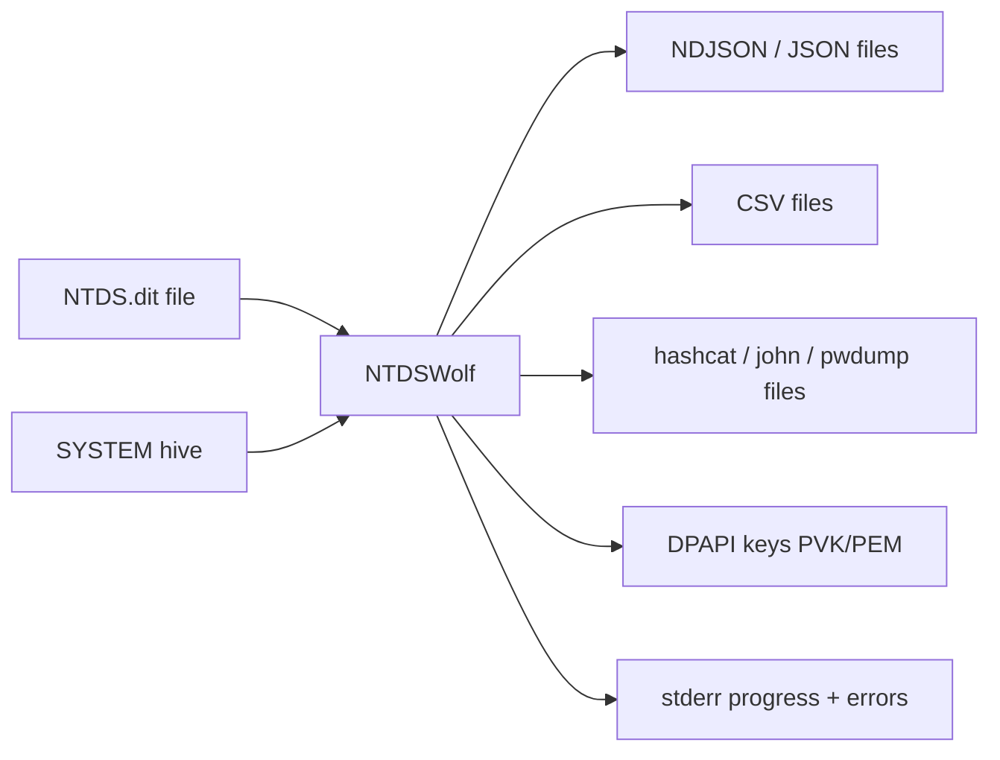
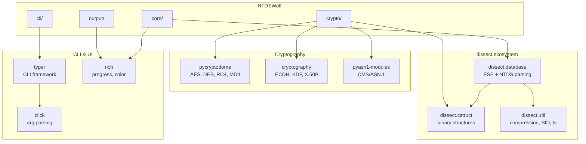
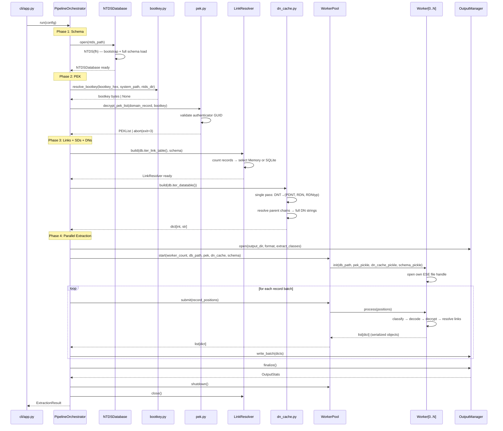
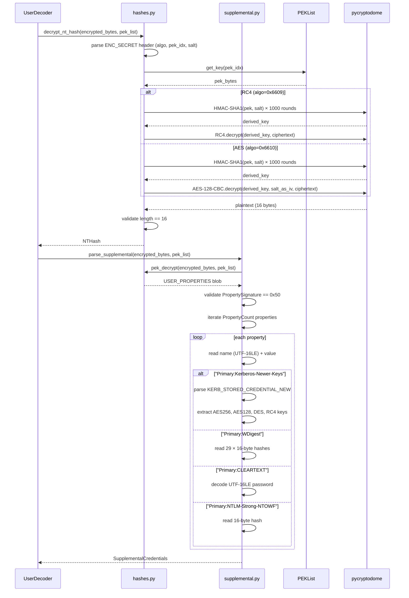
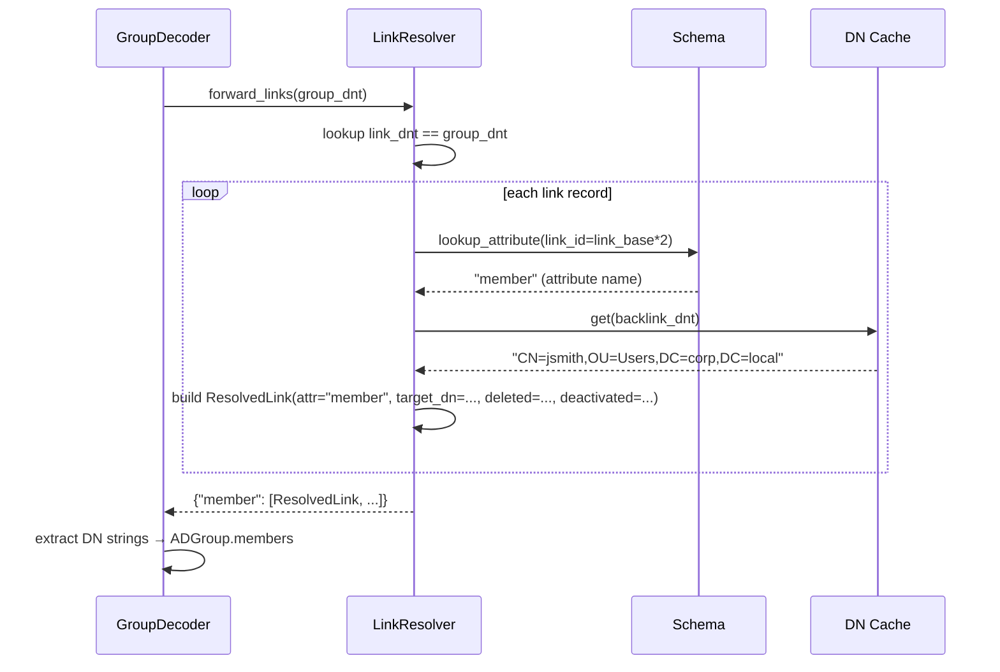
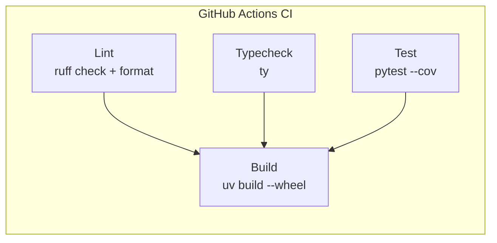

# NTDSWolf -- Architecture Document

> **Historical design document (2025-05-22).** This captures the original v0.1.0 architecture. The implementation has since evolved -- the decoder registry and worker pool are live, Kerberos/WDigest/cleartext extract via dissect, and output is cross-validated against impacket. For the current state and remaining work, see [`ROADMAP.md`](../ROADMAP.md).

**Version:** 0.1.0
**Date:** 2025-05-22
**Status:** Draft
**Upstream:** [REQUIREMENTS.md](REQUIREMENTS.md) → [DESIGN.md](DESIGN.md)

## 1. System Context

NTDSWolf is a standalone CLI tool that reads offline files (NTDS.dit, SYSTEM hive) and produces structured output files. It has no network dependencies and no runtime state beyond a single invocation.



## 2. Component Architecture

### 2.1 Layer Diagram

```mermaid
graph TB
    subgraph CLI["cli/ — Command-line interface"]
        app[app.py<br/>typer app + main command]
        callbacks[callbacks.py<br/>arg validation]
    end

    subgraph Core["core/ — Pipeline orchestration"]
        pipeline[pipeline.py<br/>PipelineOrchestrator]
        database[database.py<br/>NTDSDatabase]
        schema[schema.py<br/>schema extensions]
        links[links.py<br/>LinkResolver]
        dn_cache[dn_cache.py<br/>DN reconstruction]
        workers[workers.py<br/>worker pool]
    end

    subgraph Decoders["decoders/ — Object extraction"]
        registry[registry.py<br/>DecoderRegistry]
        base[base.py<br/>BaseDecoder]
        users[users.py]
        groups[groups.py]
        trusts_d[trusts.py]
        domains[domains.py]
        gpo[gpo.py]
        gmsa[gmsa.py]
        bitlocker[bitlocker.py]
        kds_d[kds.py]
        generic[generic.py]
    end

    subgraph Crypto["crypto/ — Decryption"]
        bootkey[bootkey.py<br/>boot key extraction]
        pek[pek.py<br/>PEK decryption]
        hashes[hashes.py<br/>NT/LM hashes]
        supplemental[supplemental.py<br/>supplementalCredentials]
        trusts_c[trusts.py<br/>trust auth]
        dpapi[dpapi.py<br/>DPAPI backup keys]
        laps[laps.py<br/>LAPS v1/v2]
        gkdi[gkdi.py<br/>MS-GKDI]
        keycred[keycredential.py<br/>WHfB/FIDO2]
        structures[structures.py<br/>cstruct definitions]
    end

    subgraph Output["output/ — Formatters"]
        out_base[base.py<br/>OutputWriter protocol]
        ndjson[ndjson.py]
        json_[json_.py]
        csv_[csv_.py]
        hashcat[hashcat.py]
        john[john.py]
        pwdump[pwdump.py]
    end

    subgraph Models["models/ — Data types"]
        objects[objects.py<br/>ADUser, ADGroup, ...]
        credentials[credentials.py<br/>NTHash, KerberosKey, ...]
        flags[flags.py<br/>UAC, GroupType, ...]
        links_m[links.py<br/>LinkRecord]
        metadata[metadata.py<br/>ReplicationMetadata]
    end

    constants[constants.py<br/>GUIDs, OIDs, empty hashes]

    CLI --> Core
    Core --> Decoders
    Core --> Output
    Decoders --> Crypto
    Decoders --> Models
    Crypto --> Models
    Output --> Models
    Models --> constants
    Crypto --> constants
    Core --> Models
```



### 2.2 Import Rules (Enforced)

These rules prevent circular dependencies and maintain clean layer separation:

| Module | May Import | Must Not Import |
|---|---|---|
| `cli/` | `core/`, `models/` | `crypto/`, `decoders/`, `output/` |
| `core/` | `crypto/`, `decoders/`, `output/`, `models/`, `constants` | `cli/` |
| `decoders/` | `crypto/`, `models/`, `constants` | `cli/`, `core/`, `output/` |
| `crypto/` | `models/`, `constants` | `cli/`, `core/`, `decoders/`, `output/` |
| `output/` | `models/`, `constants` | `cli/`, `core/`, `crypto/`, `decoders/` |
| `models/` | `constants` | Everything else |
| `constants` | stdlib only | Everything |

### 2.3 External Dependencies



## 3. Pipeline Execution Flow

### 3.1 Full Extraction Sequence



### 3.2 Credential Decryption Sequence



### 3.3 Link Resolution Sequence



## 4. Component Contracts

### 4.1 NTDSDatabase

**Responsibility:** Wrap `dissect.database.ese.ntds.NTDS` and provide the interface needed by the pipeline. Validate the database before any processing begins.

**Contract:**
- `open(path)` raises `InvalidDatabaseError` if the file is not a valid ESE database (bad magic, unsupported version).
- `unlock(bootkey)` raises `BootKeyError` if PEK authenticator validation fails. Returns silently if `bootkey` is `None` (no-decrypt mode).
- `iter_datatable()` yields ESE `Record` objects lazily. Never loads the full table into memory.
- `iter_link_table()` yields ESE `Record` objects lazily.
- `domain()` returns the domain object `Record` or `None` if no domainDNS object exists.
- Thread safety: not thread-safe. Each worker opens its own instance.

### 4.2 LinkResolver

**Responsibility:** Map DNTs to their linked attribute values in both forward and backward directions.

**Contract (Protocol):**
- `forward_links(dnt)` returns `dict[str, list[ResolvedLink]]` where keys are attribute names (`"member"`, `"managedBy"`, etc.) and values are lists of resolved links.
- `back_links(dnt)` returns the same structure for reverse links (`"memberOf"`, `"directReports"`, etc.).
- Returns empty dict for DNTs with no links.
- `close()` releases resources (SQLite connection, temp file).
- Thread/process safety: `MemoryLinkResolver` is read-only after construction and safe for concurrent access. `SqliteLinkResolver` uses per-worker read-only connections to the same temp file.

**ResolvedLink:**
```python
@dataclass(frozen=True)
class ResolvedLink:
    attribute_name: str       # LDAP name of the link attribute
    target_dnt: int           # DNT of the linked object
    target_dn: str            # Full DN of the linked object
    is_deleted: bool          # link_deltime is set
    deleted_time: datetime | None
    is_deactivated: bool      # link_deactivetime is set
    deactivated_time: datetime | None
    link_data: bytes | None   # Extra data (non-null for special links)
```

### 4.3 DecoderRegistry + BaseDecoder

**Responsibility:** Map `objectClass` values to decoder implementations. Decoders transform raw ESE records into typed dicts ready for output.

**Contract:**
- `registry.get(object_class)` returns the registered decoder or `GenericDecoder` as fallback. Never raises.
- `decoder.decode(record, context) -> dict` returns a dict representation of the object. The `context` bundles all dependencies (schema, PEK, link resolver, DN cache, SD cache).
- Decoders never perform I/O. They receive everything they need via the context.
- If decryption fails for a specific attribute, the decoder logs the error, increments the error counter in the context, and sets the attribute to `None` (or hex ciphertext if `--raw`). It never raises.
- The returned dict follows the JSON schema defined in Section 6.

**DecoderContext:**
```python
@dataclass(frozen=True)
class DecoderContext:
    schema: Schema                # Attribute lookups
    pek_list: PEKList | None      # None = no-decrypt mode
    link_resolver: LinkResolver
    dn_cache: dict[int, str]
    sd_cache: dict[int, bytes]
    include_deleted: bool
    include_raw: bool
    naming_mode: str              # "ldap" or "cn"
    errors: list[str]             # Mutable: decoders append error messages
```

### 4.4 OutputWriter + OutputManager

**Responsibility:** Serialize typed dicts to files in the requested format.

**Contract:**
- `writer.open(path, object_class)` creates/opens the output file. Raises `IOError` on filesystem errors.
- `writer.write(obj_dict)` writes a single object. Buffers internally.
- `writer.close()` flushes and closes the file.
- `OutputManager.write_batch(dicts)` dispatches each dict to the appropriate per-class writer based on `obj_dict["_object_class"]`.
- `OutputManager.finalize()` closes all writers and returns `OutputStats` (counts per class, total bytes written).
- Hash-format writers (hashcat, john, pwdump) silently skip objects without credentials.
- Writers must handle the full JSON schema (Section 6) and format each field appropriately for their format.

### 4.5 Worker Pool

**Responsibility:** Distribute datatable record processing across multiple OS processes.

**Contract:**
- Workers receive initialization data via pickle: `db_path`, `pek_list`, `dn_cache`, `schema`, `sd_cache`, `config`.
- Each worker opens its own `NTDSDatabase` instance (own file handle, own page cache).
- Workers receive batches of record identifiers (DNTs or positions) via a `multiprocessing.Queue`.
- Workers return `list[dict]` (serialized object dicts) via a result queue.
- Workers never write to output files directly. All file I/O happens in the main process.
- If a worker crashes, the main process logs the error and continues with remaining workers. Unprocessed records from the crashed worker are redistributed.
- Workers import `DecoderRegistry`, `DecoderContext`, and all decoders at init time. The registry is not pickled; it's reconstructed in each worker.

**Batch size:** 1000 records per batch (configurable). Balances IPC overhead against responsiveness.

## 5. Data Type Mapping

### 5.1 ESE → Python → JSON Type Map

| ESE Column Type | AD Syntax | Python Type | JSON Type | Example |
|---|---|---|---|---|
| `Bit` | Boolean | `bool` | `boolean` | `true` |
| `Long` | Integer | `int` | `number` | `512` |
| `Currency` | LargeInteger | `int` | `string` (as decimal) | `"132456789012345678"` |
| `Currency` | Interval (timestamps) | `str` (ISO 8601) | `string` | `"2024-01-15T10:30:45.123456+00:00"` |
| `Text` | DirectoryString | `str` | `string` | `"Administrator"` |
| `LongText` | DirectoryString | `str` | `string` | `"Long description..."` |
| `Binary` | OctetString (SID) | `str` | `string` | `"S-1-5-21-3623811015-..."` |
| `Binary` | OctetString (GUID) | `str` | `string` | `"a1b2c3d4-e5f6-..."` |
| `Binary` | OctetString (raw) | `str` (hex) | `string` | `"0102abcd..."` |
| `GUID` | OctetString | `str` | `string` | `"a1b2c3d4-e5f6-..."` |
| `DateTime` | GeneralizedTime | `str` (ISO 8601) | `string` | `"2024-01-15T10:30:45+00:00"` |
| `LongBinary` | OctetString (encrypted) | `str` (hex) | `string` | `"0102abcd..."` |

### 5.2 Timestamp Handling

All timestamps are output as ISO 8601 UTC strings. The following special values are recognized:

| Raw Value | Meaning | Output |
|---|---|---|
| `0` | Never / not set | `null` |
| `9223372036854775807` (0x7FFFFFFFFFFFFFFF) | Never expires | `"never"` |
| `9223372032559808511` | Never expires (variant) | `"never"` |
| Any other | Windows FILETIME | ISO 8601 string |

**Spec reference:** [MS-DTYP] §2.3.3 (FILETIME).

### 5.3 Flag Field Output Format

All flag/enum fields output both the raw numeric value and the decoded names:

```json
{
    "userAccountControl": {
        "value": 66048,
        "flags": ["NORMAL_ACCOUNT", "DONT_EXPIRE_PASSWD"]
    }
}
```

This ensures downstream tools can use either representation. The `value` field is always present; `flags` lists only the set bits.

## 6. JSON Output Schema

### 6.1 Common Fields (All Objects)

Every object includes these fields:

```json
{
    "_object_class": "user",
    "_dnt": 3562,
    "distinguishedName": "CN=jsmith,OU=Users,DC=corp,DC=local",
    "objectGUID": "a1b2c3d4-e5f6-7890-abcd-ef1234567890",
    "objectSid": "S-1-5-21-3623811015-3361044348-30300510-1104",
    "name": "jsmith",
    "whenCreated": "2023-03-15T10:30:45.000000+00:00",
    "whenChanged": "2024-11-20T14:22:30.000000+00:00",
    "isDeleted": false,
    "nTSecurityDescriptor": "O:DAG:DAD:...",
    "instanceType": {
        "value": 4,
        "flags": ["WRITE"]
    }
}
```

`_object_class` and `_dnt` are synthetic fields (prefixed with `_`) that NTDSWolf adds for identification. All other fields use their LDAP display names.

### 6.2 User Object

```json
{
    "_object_class": "user",
    "_dnt": 3562,
    "distinguishedName": "CN=jsmith,OU=Users,DC=corp,DC=local",
    "objectGUID": "a1b2c3d4-e5f6-7890-abcd-ef1234567890",
    "objectSid": "S-1-5-21-3623811015-3361044348-30300510-1104",
    "name": "jsmith",
    "sAMAccountName": "jsmith",
    "userPrincipalName": "jsmith@corp.local",
    "displayName": "John Smith",
    "userAccountControl": {
        "value": 66048,
        "flags": ["NORMAL_ACCOUNT", "DONT_EXPIRE_PASSWD"]
    },
    "sAMAccountType": "SAM_USER_OBJECT",
    "adminCount": 1,
    "pwdLastSet": "2024-10-20T14:22:30.000000+00:00",
    "lastLogonTimestamp": "2024-11-18T09:15:22.000000+00:00",
    "lastLogon": "2024-11-20T08:30:00.000000+00:00",
    "accountExpires": "never",
    "badPasswordTime": "2024-11-15T12:00:00.000000+00:00",
    "badPwdCount": 2,
    "lockoutTime": null,
    "whenCreated": "2023-03-15T10:30:45.000000+00:00",
    "whenChanged": "2024-11-20T14:22:30.000000+00:00",
    "isDeleted": false,
    "description": "IT Administrator",
    "mail": "jsmith@corp.local",
    "title": "Senior Systems Administrator",
    "department": "IT",
    "manager": "CN=jdoe,OU=Managers,DC=corp,DC=local",
    "memberOf": [
        "CN=Domain Admins,CN=Users,DC=corp,DC=local",
        "CN=IT-Staff,OU=Groups,DC=corp,DC=local"
    ],
    "sIDHistory": [],
    "credentials": {
        "ntHash": "e52cac67419a9a224a3b108f3fa6cb6d",
        "lmHash": "aad3b435b51404eeaad3b435b51404ee",
        "ntHistory": [
            "e52cac67419a9a224a3b108f3fa6cb6d",
            "a87f3c5b0d12e4f6789012345678abcd"
        ],
        "lmHistory": [],
        "kerberos": [
            {
                "keyType": "AES256-CTS-HMAC-SHA1-96",
                "keyValue": "a1b2c3d4e5f67890...",
                "salt": "CORP.LOCALjsmith",
                "iterationCount": 4096
            },
            {
                "keyType": "AES128-CTS-HMAC-SHA1-96",
                "keyValue": "abcdef1234567890",
                "salt": "CORP.LOCALjsmith",
                "iterationCount": 4096
            },
            {
                "keyType": "RC4-HMAC",
                "keyValue": "e52cac67419a9a224a3b108f3fa6cb6d",
                "salt": "CORP.LOCALjsmith",
                "iterationCount": 4096
            }
        ],
        "wdigest": [
            "hash1hex...",
            "hash2hex...",
            "..."
        ],
        "cleartextPassword": null,
        "ntlmStrongNTOWF": null
    },
    "msDS-SupportedEncryptionTypes": {
        "value": 28,
        "flags": ["AES128_CTS_HMAC_SHA1_96", "AES256_CTS_HMAC_SHA1_96", "RC4_HMAC"]
    },
    "replPropertyMetaData": [
        {
            "attribute": "unicodePwd",
            "version": 3,
            "lastOriginatingChange": "2024-10-20T14:22:30.000000+00:00",
            "originatingDsa": "a1b2c3d4-e5f6-7890-abcd-ef1234567890",
            "originatingUsn": 123456,
            "localUsn": 789012
        }
    ],
    "msDS-KeyCredentialLink": [
        {
            "keyId": "abc123...",
            "keyType": "NGC",
            "keyUsage": "NGC",
            "deviceId": "device-guid-here",
            "creationTime": "2024-06-01T12:00:00.000000+00:00",
            "publicKey": "base64-encoded-public-key..."
        }
    ]
}
```

### 6.3 Computer Object

```json
{
    "_object_class": "computer",
    "_dnt": 4210,
    "distinguishedName": "CN=WORKSTATION01,OU=Workstations,DC=corp,DC=local",
    "objectSid": "S-1-5-21-3623811015-3361044348-30300510-1105",
    "sAMAccountName": "WORKSTATION01$",
    "dNSHostName": "workstation01.corp.local",
    "operatingSystem": "Windows 11 Enterprise",
    "operatingSystemVersion": "10.0 (22631)",
    "userAccountControl": {
        "value": 4096,
        "flags": ["WORKSTATION_TRUST_ACCOUNT"]
    },
    "credentials": {
        "ntHash": "...",
        "lmHash": "aad3b435b51404eeaad3b435b51404ee",
        "ntHistory": [],
        "lmHistory": [],
        "kerberos": [],
        "wdigest": [],
        "cleartextPassword": null,
        "ntlmStrongNTOWF": null
    },
    "laps": {
        "version": 2,
        "password": "x7#Qm9$pL2!wK5@r",
        "expiration": "2025-01-15T00:00:00.000000+00:00",
        "accountName": "LocalAdmin"
    },
    "msDS-AllowedToDelegateTo": [
        "cifs/fileserver.corp.local",
        "http/webserver.corp.local"
    ],
    "msDS-AllowedToActOnBehalfOfOtherIdentity": [
        "S-1-5-21-3623811015-3361044348-30300510-1234"
    ],
    "memberOf": [
        "CN=Domain Computers,CN=Users,DC=corp,DC=local"
    ]
}
```

### 6.4 Group Object

```json
{
    "_object_class": "group",
    "_dnt": 1150,
    "distinguishedName": "CN=Domain Admins,CN=Users,DC=corp,DC=local",
    "objectSid": "S-1-5-21-3623811015-3361044348-30300510-512",
    "sAMAccountName": "Domain Admins",
    "groupType": {
        "value": -2147483646,
        "flags": ["GLOBAL_GROUP", "SECURITY_ENABLED"]
    },
    "adminCount": 1,
    "description": "Designated administrators of the domain",
    "member": [
        "CN=Administrator,CN=Users,DC=corp,DC=local",
        "CN=jsmith,OU=Users,DC=corp,DC=local"
    ],
    "memberOf": [
        "CN=Administrators,CN=Builtin,DC=corp,DC=local"
    ]
}
```

### 6.5 Trust Object

```json
{
    "_object_class": "trustedDomain",
    "_dnt": 5001,
    "distinguishedName": "CN=partner.local,CN=System,DC=corp,DC=local",
    "trustPartner": "partner.local",
    "flatName": "PARTNER",
    "securityIdentifier": "S-1-5-21-9876543210-1234567890-1111111111",
    "trustType": "UPLEVEL",
    "trustDirection": {
        "value": 3,
        "flags": ["INBOUND", "OUTBOUND"]
    },
    "trustAttributes": {
        "value": 32,
        "flags": ["FOREST_TRANSITIVE"]
    },
    "msDS-SupportedEncryptionTypes": {
        "value": 28,
        "flags": ["AES128_CTS_HMAC_SHA1_96", "AES256_CTS_HMAC_SHA1_96", "RC4_HMAC"]
    },
    "trustCredentials": {
        "outgoing": {
            "cleartextPassword": "long-trust-password-here",
            "rc4HmacKey": "abcdef1234567890abcdef1234567890",
            "aes128Key": "1234567890abcdef1234567890abcdef",
            "aes256Key": "abcdef1234567890abcdef1234567890abcdef1234567890abcdef1234567890ab",
            "previous": {
                "cleartextPassword": "old-trust-password",
                "rc4HmacKey": "...",
                "aes128Key": "...",
                "aes256Key": "..."
            }
        },
        "incoming": {
            "cleartextPassword": "...",
            "rc4HmacKey": "...",
            "aes128Key": "...",
            "aes256Key": "...",
            "previous": null
        }
    }
}
```

### 6.6 Domain Object

```json
{
    "_object_class": "domainDNS",
    "_dnt": 2,
    "distinguishedName": "DC=corp,DC=local",
    "objectSid": "S-1-5-21-3623811015-3361044348-30300510",
    "name": "corp",
    "msDS-Behavior-Version": 7,
    "minPwdLength": 12,
    "maxPwdAge": "-12960000000000",
    "minPwdAge": "-864000000000",
    "lockoutThreshold": 5,
    "lockoutDuration": "-18000000000",
    "lockoutObservationWindow": "-18000000000",
    "pwdProperties": {
        "value": 1,
        "flags": ["DOMAIN_PASSWORD_COMPLEX"]
    },
    "pwdHistoryLength": 24
}
```

### 6.7 BitLocker Recovery Object

```json
{
    "_object_class": "msFVE-RecoveryInformation",
    "_dnt": 8001,
    "distinguishedName": "CN=2024-01-15T10:30:45-00:00{GUID},CN=WORKSTATION01,OU=Workstations,DC=corp,DC=local",
    "msFVE-RecoveryPassword": "123456-789012-345678-901234-567890-123456-789012-345678",
    "msFVE-VolumeGuid": "a1b2c3d4-e5f6-7890-abcd-ef1234567890",
    "msFVE-KeyPackage": "hex-encoded-key-package-blob..."
}
```

### 6.8 DPAPI Backup Key Output

DPAPI backup keys are written to a subdirectory rather than JSON:

```
ntdswolf_output/
  dpapi_backup_keys/
    domain_backup_key.pvk         # RSA private key (PVK format)
    domain_backup_key_cert.pem    # X.509 certificate (PEM format)
    domain_backup_key.json        # Metadata (key ID, creation time)
```

### 6.9 Generic Object (Unknown Class)

Objects with unregistered object classes are output with all raw attributes:

```json
{
    "_object_class": "msExchMailboxDatabase",
    "_dnt": 9500,
    "distinguishedName": "CN=Mailbox Database,CN=Exchange,DC=corp,DC=local",
    "cn": "Mailbox Database",
    "objectGUID": "...",
    "ATTm131532": "raw-value-for-unresolved-attr",
    "...": "..."
}
```

Attributes that can be resolved to LDAP names are; those that cannot are output with their `ATTx######` column name.

## 7. Hash Output Format Specifications

### 7.1 hashcat Format

**NT hashes (mode 1000):**
```
e52cac67419a9a224a3b108f3fa6cb6d
```
One hash per line. Use with `hashcat -m 1000`.

**LM hashes (mode 3000):**
```
aad3b435b51404ee
aad3b435b51404ee
```
LM hashes split into two 8-byte halves. Use with `hashcat -m 3000`.

**File naming:** `hashes_nt.hashcat`, `hashes_lm.hashcat`, `hashes_nt_history.hashcat`.

**User mapping file:** `hashes_nt.hashcat.users` with `hash:domain\username` mapping for result correlation.

### 7.2 John the Ripper Format

```
jsmith:$NT$e52cac67419a9a224a3b108f3fa6cb6d
WORKSTATION01$:$NT$a1b2c3d4e5f67890a1b2c3d4e5f67890
```

**File naming:** `hashes.john`, `hashes_history.john`.

### 7.3 pwdump Format

```
jsmith:1104:aad3b435b51404eeaad3b435b51404ee:e52cac67419a9a224a3b108f3fa6cb6d:::
Administrator:500:aad3b435b51404eeaad3b435b51404ee:fc525c9683e8fe067095ba2ddc971889:::
```

Format: `username:rid:lm_hash:nt_hash:::`

**History entries:** `jsmith__history0:1104:...:...:::`, `jsmith__history1:1104:...:...:::`

**File naming:** `hashes.pwdump`, `hashes_history.pwdump`.

### 7.4 CSV Format

CSV output uses a flat schema with one row per object:

```csv
distinguishedName,sAMAccountName,objectSid,userAccountControl,userAccountControl_flags,pwdLastSet,lastLogonTimestamp,ntHash,lmHash,memberOf,isDeleted
"CN=jsmith,OU=Users,DC=corp,DC=local",jsmith,S-1-5-21-...,66048,"NORMAL_ACCOUNT|DONT_EXPIRE_PASSWD",2024-10-20T14:22:30+00:00,2024-11-18T09:15:22+00:00,e52cac67...,aad3b435...,"CN=Domain Admins,...|CN=IT-Staff,...",false
```

Multi-valued fields are pipe-delimited within cells. Flag fields get a companion `_flags` column with the human-readable names.

## 8. File Layout (Final)

```
ntdswolf/
├── pyproject.toml                     # Project config, dependencies, entry point
├── README.md
├── LICENSE
├── docs/
│   ├── REQUIREMENTS.md
│   ├── DESIGN.md
│   └── ARCHITECTURE.md
├── src/
│   └── ntdswolf/
│       ├── __init__.py                # __version__
│       ├── __main__.py                # python -m ntdswolf
│       ├── constants.py               # Well-known values, spec constants
│       ├── cli/
│       │   ├── __init__.py
│       │   ├── app.py                 # typer app, main command
│       │   └── callbacks.py           # Argument validators
│       ├── core/
│       │   ├── __init__.py
│       │   ├── database.py            # NTDSDatabase
│       │   ├── schema.py              # Schema extensions
│       │   ├── pipeline.py            # PipelineOrchestrator
│       │   ├── links.py               # LinkResolver (Memory + SQLite)
│       │   ├── dn_cache.py            # DN reconstruction
│       │   └── workers.py             # Worker pool
│       ├── crypto/
│       │   ├── __init__.py
│       │   ├── bootkey.py             # Boot key extraction
│       │   ├── pek.py                 # PEK decryption
│       │   ├── hashes.py              # NT/LM hash decryption
│       │   ├── supplemental.py        # supplementalCredentials
│       │   ├── trusts.py              # Trust auth decryption
│       │   ├── dpapi.py               # DPAPI backup keys
│       │   ├── laps.py                # LAPS v1/v2
│       │   ├── gkdi.py                # MS-GKDI key derivation
│       │   ├── keycredential.py       # WHfB / FIDO2
│       │   └── structures.py          # dissect.cstruct wire formats
│       ├── decoders/
│       │   ├── __init__.py
│       │   ├── registry.py            # DecoderRegistry
│       │   ├── base.py                # BaseDecoder
│       │   ├── users.py               # User + Computer
│       │   ├── groups.py              # Group
│       │   ├── trusts.py              # TrustedDomain
│       │   ├── domains.py             # DomainDNS
│       │   ├── gpo.py                 # GroupPolicyContainer
│       │   ├── gmsa.py                # gMSA
│       │   ├── bitlocker.py           # msFVE-RecoveryInformation
│       │   ├── kds.py                 # msKds-ProvRootKey
│       │   └── generic.py             # Fallback decoder
│       ├── output/
│       │   ├── __init__.py
│       │   ├── base.py                # OutputWriter protocol, OutputManager
│       │   ├── ndjson.py
│       │   ├── json_.py
│       │   ├── csv_.py
│       │   ├── hashcat.py
│       │   ├── john.py
│       │   └── pwdump.py
│       └── models/
│           ├── __init__.py
│           ├── objects.py             # ADUser, ADComputer, ADGroup, ...
│           ├── credentials.py         # NTHash, KerberosKey, ...
│           ├── flags.py               # IntFlag/IntEnum definitions
│           ├── links.py               # LinkRecord, ResolvedLink
│           └── metadata.py            # ReplicationMetadata, SD
├── tests/
│   ├── conftest.py                    # Shared fixtures
│   ├── fixtures/                      # Test NTDS.dit files, SYSTEM hives
│   ├── test_bootkey.py
│   ├── test_pek.py
│   ├── test_hashes.py
│   ├── test_supplemental.py
│   ├── test_trusts.py
│   ├── test_dpapi.py
│   ├── test_laps.py
│   ├── test_gkdi.py
│   ├── test_keycredential.py
│   ├── test_decoders.py
│   ├── test_links.py
│   ├── test_dn_cache.py
│   ├── test_output_ndjson.py
│   ├── test_output_hashcat.py
│   ├── test_output_pwdump.py
│   ├── test_flags.py
│   ├── test_pipeline_integration.py
│   └── test_cli.py
└── .github/
    └── workflows/
        └── ci.yml                     # lint + typecheck + test + build
```

**Source layout note:** Uses `src/` layout (`src/ntdswolf/`) per modern Python packaging best practices. This prevents the package from being importable from the repo root without installation, catching packaging errors early.

## 9. Build & CI Configuration

### 9.1 pyproject.toml Structure

```toml
[project]
name = "ntdswolf"
version = "0.1.0"
description = "Offline NTDS.dit parser and credential extractor"
requires-python = ">=3.14"
dependencies = [
    "dissect.database",
    "pycryptodome",
    "cryptography",
    "pyasn1-modules",
    "typer",
    "rich",
]

[project.scripts]
ntdswolf = "ntdswolf.cli.app:app"

[dependency-groups]
dev = ["pytest", "pytest-cov", "ruff"]
docs = ["mkdocs", "mkdocs-material"]

[tool.ruff]
target-version = "py314"
line-length = 320
src = ["src"]

[tool.ruff.lint]
select = ["ALL"]
ignore = ["COM812", "ISC001", "D203", "D213"]

[tool.ruff.lint.per-file-ignores]
"tests/**" = ["D", "S101", "S105", "S106", "ANN", "PLR2004", "SLF001", "N802"]

[tool.ty]
python-version = "3.14"

[tool.ty.rules]
all = "error"

[tool.ty.overrides.per-file-ignores]
"tests/**" = { all = "ignore" }

[tool.pytest.ini_options]
testpaths = ["tests"]
```

### 9.2 CI Pipeline



All jobs run on every push and PR. Build job depends on all three checks passing. Each job has `timeout-minutes` set and uses `concurrency` with `cancel-in-progress` for PRs.

## 10. Security Considerations

### 10.1 Sensitive Data Handling

- NTDSWolf processes and outputs password hashes, cleartext passwords, private keys, and other sensitive material. Output files should be treated as highly sensitive.
- NTDSWolf does not implement any access controls on output files beyond standard filesystem permissions. Users are responsible for securing output directories.
- The `--bootkey` CLI argument passes sensitive material via command line, which may be visible in process listings. Users should prefer `--system` or auto-detect where possible.
- Worker processes hold decrypted PEK material in memory. This is unavoidable for the decryption workflow.

### 10.2 Input Validation

- ESE database magic number and version are validated before processing.
- PEK authenticator GUID is validated after decryption. A mismatch indicates a wrong boot key and aborts processing rather than producing incorrect hashes.
- All `dissect.cstruct` structure parsing validates field sizes against expected lengths. Malformed blobs raise specific exceptions caught by decoders.
- File paths from CLI arguments are validated for existence and readability before pipeline execution.
